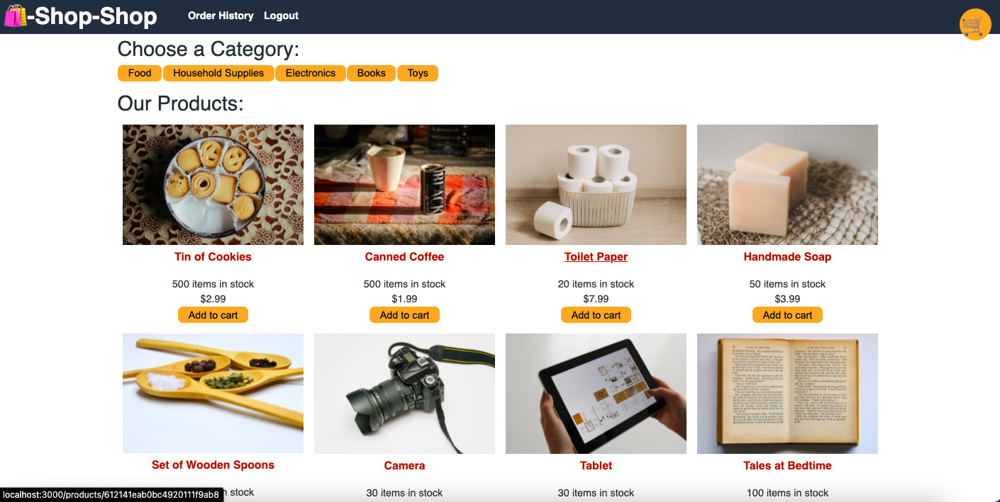
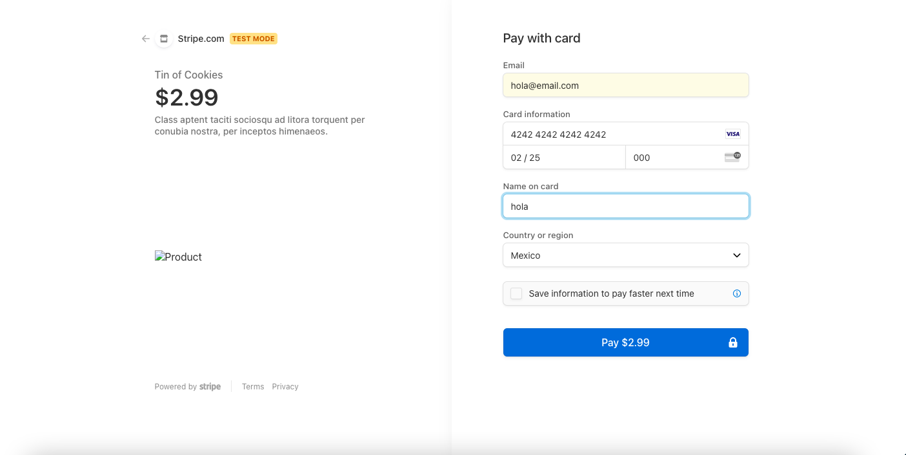

# Redux Store

## Description
AS a senior engineer working on an e-commerce platform
I WANT my platform to use Redux to manage global state instead of the Context API
SO THAT my website's state management is taken out of the React ecosystem

## Installation
This project has been deployed to GitHub. https://github.com/Eduadomtz/Redux-Storenp

To get this project up and running, you can follow the deployment link. https://gentle-brushlands-82250.herokuapp.com

## Usage
Select the type you want and then Checkout in your shopping cart 

Pay for your product and just wait for it to arrive!

## Features
- HTML
- JS
- CSS
- React
- Redux

  ## Questions
  If you have any questions about the repo, open an issue or contact me directly at eduardo31794@gmail.com You can find more of my work at https://github.com/Eduadomtz